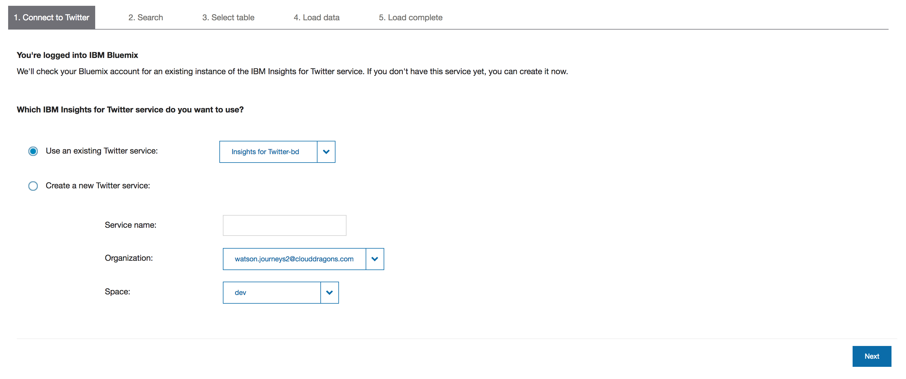
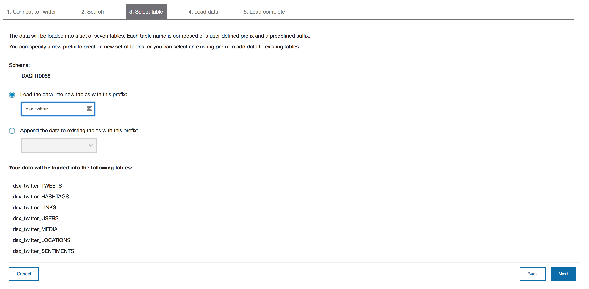
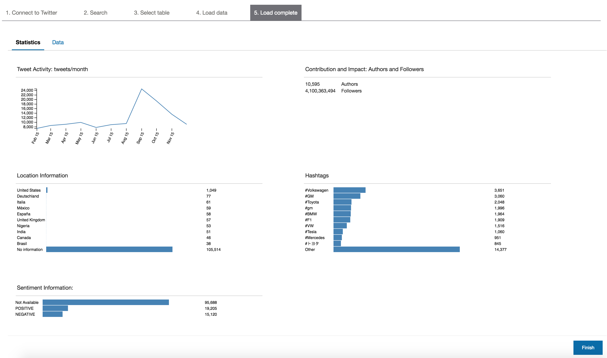
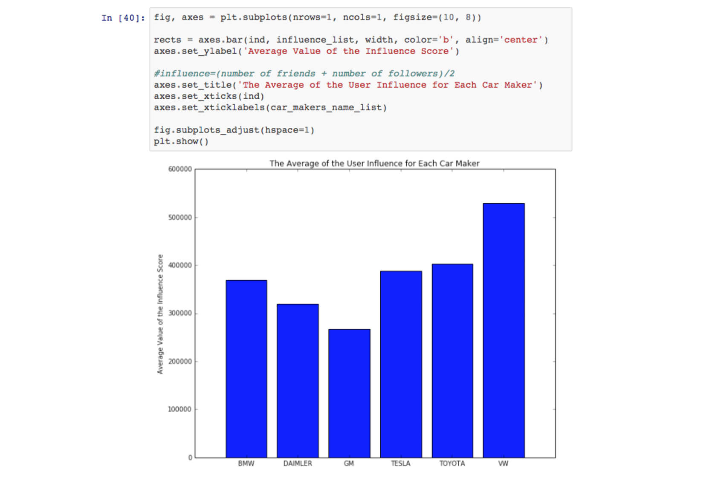

# Twitter Analysis with Jupyter Notebooks

In this developer journey we will use Jupyter notebooks to analyze Twitter
data and extract interesting insights from tweets. It will easily perform
complex computations on a large amount of data in a notebook by using
SparkContext, which enables you to run tasks on the Spark cluster. In
addition, it will integrate data from dashDB using the Spark connector
and use Spark and pandas DataFrames.

When the reader has completed this journey, they will understand how to:

* Create a dashDB warehouse containing Twitter data that includes advanced
  enrichments like sentiment, gender and location
* Transform the data using Python code with Apache Spark and Pandas data
  frames.
* Create visualizations using Matplotlib and Google GeoChart
* Share notebooks and results

The intended audience for this journey is application developers who need
to efficiently build powerful data visualizations, but who may not have
an abundance of time, data science experience or a dedicated data science
team who could take ownership of such an effort.

## Included Components

* IBM Data Science Experience
* Bluemix Insights for Twitter
* Bluemix dashDB for Analytics
* Bluemix Analytics for Apache Spark
* Jupyter Notebooks
* Python
* Pandas (Python Data Analysis Library)

# Steps

Perform steps 1-6 or choose the **Deploy to Bluemix** button and jump to step 4.

1. [Clone the repo](#1-clone-the-repo)
2. [Sign up for the DataScience Experience](#2-sign-up-for-the-datascience-experience)
3. [Create Bluemix services](#3-create-bluemix-services)
4. [Configure dashDB](#4-configure-dashdb)
5. [Running the Jupyter Notebook](#5-running-the-jupyter-notebook)

## 1. Clone the repo

Clone the `dsx-auto-twitter-analysis` locally. In a terminal, run:

  `$ git clone https://github.com/ibm/dsx-auto-twitter-analysis`

We’ll be using the file `notebooks/dsx_twitter_auto_analysis.ipynb`.

## 2. Sign up for the DataScience Experience

Sign up for IBM's [Data Science Experience](http://datascience.ibm.com/). By signing up for the Data Science Experience, two services: ``DSX-Spark`` and ``DSX-ObjectStore`` will be created in your Bluemix account.

## 3. Create Bluemix services

Create the following Bluemix services:

  * [**dashDB for Analytics**](https://console.ng.bluemix.net/catalog/services/dashdb-for-analytics)
  * [**Insights for Twitter**](https://console.ng.bluemix.net/catalog/services/insights-for-twitter)

## 4. Configure dashDB

The first step in the analysis process is to harvest the Twitter data. In
this sample, we use the dashDB connector to the IBM Insights for Twitter
service to seamlessly specify a filter query (tweeets about the six leading
car manufacturers in 2015) and load the results into dashDB. This specific
time frame and filter are being used to demonstrate analysis of a known
Twitter spike.

* Launch the dashDB, from the menu on the left, choose ``Load`` and select
  ``Load Twitter Data``. This is a five step process outlined below.

* **Connect to Twitter**: Select the existing **dashDB** service you created
  earlier

* **Search**: In the Search for Twitter data box, enter the query below and
  retrieve a sampling of tweets.

  ``posted:2015-01-01,2015-12-31 followers_count:2000 listed_count:1000 ``
  ``(volkswagen OR vw OR toyota OR daimler OR mercedes OR bmw OR gm OR ``
  ``"general motors" OR tesla)``

* **Select table**: In the *Load the data into new tables with this prefix*
  field, enter any text you wish for a namespace.

* **Load data**: This step can take up to 20 minutes, dashDB shows you
  progress as the tweets load.

* **Load complete**: Peruse the reports that dashDB shows.

## 5. Running the Jupyter Notebook

The sample is structured into different sections. In the first sections, you will perform a general analysis on data set then you will go deeper in the analysis to gain meaningful insights about manufacturers.
Learning goals:

1. Determine the countries with the highest number of tweets (based on the user profile information).
1. Analyze tweet sentiments
1. Draw insights from tweets about major car manufacturers worldwide by combining Twitter timeline analysis with sentiment, gender distribution and location distribution.

### Create a notebook in DSX
Use the menu on the left to select "My Projects" and then "Default Project".
Click on "add notebooks" (upper right) to create a notebook.

* Select the "From File" tab.
* Enter a name for the notebook.
* Optionally, enter a description for the notebook.
* Hit "Choose File" and navigate to the notebooks/dsx_twitter_analysis.ipynb file
    * The choose file instructions assume you have a local git clone of the repo.
    * TODO: Use the "From URL" tab instead with a public repo URL
* Use the "Spark Service" pulldown to select your "DSX-Spark" service.

### Important steps to running notebook successfully:
At the top of the notebook, provide your dashDB info.

* Make sure you update SCHEMA and PREFIX with values you set when importing Twitter data into dashDB.
* Use uname/password/jdbcurl from dashDB "Service Credentials" tab in BlueMix.
  You will have to create your own credentials using the "New Credential" option.
  Normally these would be generated/found in the DSX Connect panel, but this
  is not the case if you are using the entry (i.e. free) version of dashDB. 

### Analyzing tweets

In this notebook sample, you will use SparkContext which enables you to run tasks on the Spark cluster. Using Spark in notebooks enables you to analyze large amounts of data very efficiently. The sample begins with basic analysis steps which slowly progress into deeper analytic work. In this Notebook, we will analyze the loaded data to extract interesting insights and plots from it. This analysis is performed using SparkContext which enables us to run tasks on spark cluster. Using spark and notebooks is a very strong combination. It enables you to analyze big amount of data very efficiently. We will start with some basic analysis then go deeper gradually.

### How to execute the steps in your notebook:

When a notebook is executed, what is actually happening is that each code cell in the notebook is executed, in order, from top to bottom.

Each code cell is selectable and is preceded by a tag in the left margin. The tag format is “In [x]:”. Depending on the state of the notebook, the “x” can be:

* A blank, This indicates that the cell has never been executed.
* A number. This number represents the relative order this code step was executed.
* An “*”. This indicates that the cell is current executing.

There are several ways to execute the code cells in your notebook:

* One cell at a time.
    * Select the cell, and then press the “play” button in the toolbar.
* Batch mode, in sequential order.
    * From the “Cell” menu bar, there are several options available. For example, you can “Run All” cells in your notebook, or you can “Run All Below”, that will start executing from the first cell under the currently selected cell, and then continue executing all cells that follow.
* At a scheduled time.
    * Press the “Schedule” button located in the top right section of your notebook panel. Here you can schedule your notebook to be executed once at some future time, or repeatedly at your specified interval.

### How to save your work:

Under the “File” menu, there are several ways to save your notebook:

* “Save Version” will save your current state of your notebook with a version tag that contains a date and time stamp. Up to 10 versions of your notebook can be saved, each one retrievable by selecting the “Revert To Version” menu item.
* “Save” will simply save the current state of your notebook, without any version information.

### How to share your work:

You can share your notebook by selecting the “Share” button located in the top right section of your notebook panel. The end result of this action will be a URL link that will display a “read-only” version of your notebook. You have several options to specify exactly what you want shared from your notebook:

* “Only text and output” - this option will remove all code cells from the notebook view.
* “All content excluding sensitive code cells” - this option will remove any code cells
  that contain a “sensitive” tag. For example, "# @hidden_cell" is used to protect
  your dashDB credentials from being shared.
* “All content, including code” - this option displays the notebook as is.
* A variety of "download as" options are also availble in the menu.

# Sample output

The following is a sample data visualization:

For a full example see ``data/examples/sample_output.pdf``.

# Troubleshooting

Notebooks should following the structure outlined below:

* Importing libraries
* Defining global variables and helper functions
* Acquiring the data
* Transforming the data
* Determining the distribution of tweets across geographies
* Analyzing tweet sentiments
* Analyzing Twitter timelines
* Drawing insights from tweets about car manufacturers
* Summary

# License

[Apache 2.0](LICENSE.txt)
